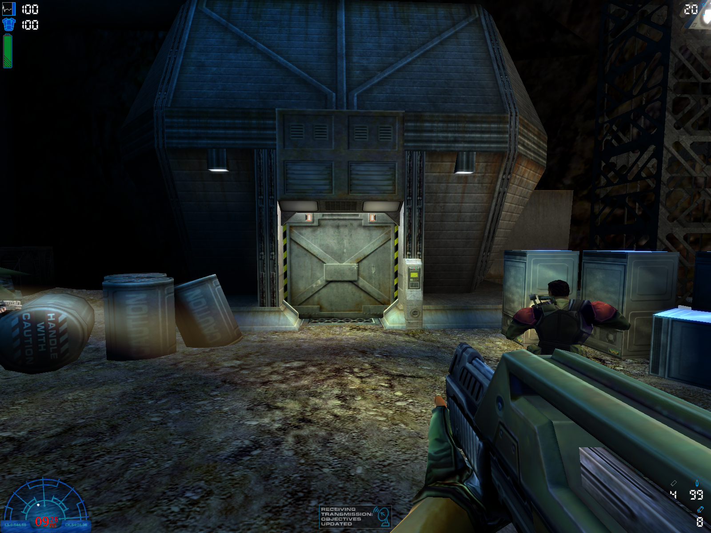

# d3d11_avp2

Fully (almost) functional DirectX 11 renderer for Aliens vs Predator 2.  
Partially reverse engineering project (bindings between AVP2 engine and its renderer), partially attempt on learning DirectX 11 and partially a port of DirectX9 NOLF2 renderer.



### Installation

Replace **d3d.ren** file in the game folder. Don't forget to backup the original file.

### Usage

Launch the game with extra **D3D11_RefreshRate** console variable in the command line (specify desired display refresh rate there).

```
lithtech.exe -rez AVP2.REZ -rez SOUNDS.REZ -rez AVP2L.REZ -rez AVP2DLL.REZ -rez MARINE.REZ -rez ALIEN.REZ -rez PREDATOR.REZ -rez MULTI.REZ -rez avp2p.rez -rez avp2p1.rez -rez avp2p5.rez +D3D11_RefreshRate 144
```

### High priority TODO list (before the demo release)

* TWM coloring (point shade)
* World dynamic color light tweaks
* Last model lighting implementation
* D3D7Fix support
* Testing with mods (MSP, AJLMod)
* Perfromance testing
* Primal Hunt expansion support

### Special thanks

burmaraider, Amphos, daupoh